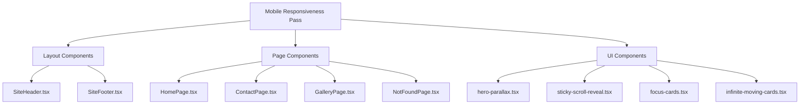

# Design Document: Mobile Responsiveness

## Overview

This design addresses the mobile responsiveness pass for the Baba Flats SPA. The site is built with React 19, TypeScript, Vite 8, and Tailwind CSS 3. It already uses some responsive utilities (`md:` breakpoints, a mobile nav bar, a mobile CTA bar) but needs a thorough pass to ensure a polished experience on viewports from 320px to 767px.

The approach is CSS-first: all changes use Tailwind responsive utilities and minor component prop adjustments. No new dependencies are introduced. The strategy is mobile-first — define the base (mobile) styles, then layer on `sm:` (640px+) and `md:` (768px+) overrides.

### Breakpoint Strategy

| Token | Min-width | Usage |
|-------|-----------|-------|
| (base) | 0px | Mobile phones (320–639px) |
| `sm:` | 640px | Large phones / small tablets |
| `md:` | 768px | Tablets and up (desktop layout) |
| `lg:` | 1024px | Desktop refinements |

The primary target for this feature is the base → `md:` range. The existing `w-[min(1140px,92vw)]` container pattern is preserved throughout.

## Architecture

No architectural changes are required. This feature is purely a CSS/Tailwind class update pass across existing components and pages. The changes fall into these categories:

1. **Class string updates** — Adding/modifying Tailwind responsive prefixed classes on existing JSX elements
2. **Component prop adjustments** — Passing mobile-appropriate values (e.g., reduced heights, widths) to reusable UI components
3. **Overflow containment** — Adding `overflow-hidden` to containers that can produce horizontal scroll on mobile

### Change Scope

### Design Decisions

1. **No hamburger menu** — The current pill-button mobile nav is kept. It wraps naturally and is already visible. The fix is ensuring minimum tap targets and no overflow at 320px.

2. **StickyScroll mobile fallback** — On mobile, the sticky side-by-side layout doesn't work well. The component already renders a static media preview above text on mobile (`md:hidden` block) and hides the sticky media (`hidden md:block`). We ensure the mobile preview has appropriate sizing.

3. **HeroParallax overflow containment** — The 3D parallax rows translate horizontally and can exceed viewport width. The fix is `overflow-hidden` on the outer container for mobile viewports.

4. **Bottom CTA bar spacing** — The fixed bottom bar overlaps content. Adding `pb-24` (6rem) to the main content area on mobile ensures the last section is never hidden.

5. **Single-column stacking** — All multi-column grids (`md:grid-cols-*`) already collapse to single column at base. We verify and fix any that don't.

## Components and Interfaces

No new components or interfaces are introduced. All changes are to existing component class strings.

### SiteHeader Changes

**Current issues:**
- Mobile nav pill buttons have small tap targets (~24px tall)
- CTA button text can truncate at 320px

**Changes:**
- Increase mobile nav link padding to ensure 44px minimum tap height: `py-2.5` (from `py-1.5`)
- Ensure CTA button has `min-h-[44px]` and `whitespace-nowrap`
- Add `min-h-[44px]` to mobile nav links

### SiteFooter Changes

**Current issues:**
- Footer grid uses `md:grid-cols-3` which correctly stacks on mobile, but gap/padding could be tighter

**Changes:**
- Already stacks correctly. Verify `gap-10` is appropriate on mobile (it is — provides clear separation between stacked sections).

### HomePage Changes

**Hero section:**
- Reduce hero card padding on mobile: `p-4 md:p-8` (from `p-5 md:p-8`)
- Scale heading: ensure `text-[1.75rem]` minimum on mobile (current `text-3xl` = 1.875rem ✓)
- HeroParallax: reduce mobile height to `h-[70vh] md:h-[128vh]` to prevent excessive empty scroll
- HeroParallax card items: use `w-[80vw] sm:w-[17.5rem] md:w-[24rem]` to fit viewport

**Unit explorer grid:**
- Already uses `md:grid-cols-3` — stacks to single column on mobile ✓

**FAQ section:**
- Already uses `md:grid-cols-[0.85fr_1.15fr]` — stacks on mobile ✓

**Map section:**
- Already uses `md:grid-cols-[1fr_2fr]` — stacks on mobile ✓

**Why Choose / Neighborhood sections:**
- Already use `md:grid-cols-[...]` — stack on mobile ✓
- Sticky sidebar becomes static on mobile (no `sticky` without `md:sticky`) ✓

**Mobile CTA bar:**
- Add `pb-24 md:pb-0` to main element to prevent overlap
- Ensure buttons have `min-h-[44px]`
- Already hidden on `md:` via `md:hidden` ✓

**Section spacing:**
- Use `py-12 md:py-24` for sections (from `py-16 md:py-24`) to reduce mobile vertical padding

### ContactPage Changes

**Hero section:**
- Already stacks vertically on mobile via `md:flex-row` ✓
- Leasing desk card stacks below text content on mobile ✓

**Form section:**
- Already uses `md:grid-cols-2` — stacks on mobile ✓
- Add `min-h-[44px]` to form inputs: update `inputCls` to `"h-11"` (44px)
- Submit button: already `w-full sm:w-max` ✓

### GalleryPage Changes

**Filter buttons:**
- Increase padding for 44px tap targets: `py-2.5` minimum on mobile
- Current: `px-3 py-1.5` → change to `px-3 py-2.5 sm:py-2`

**Photo grid:**
- Already uses `grid-cols-1 sm:grid-cols-2 lg:grid-cols-3` ✓
- Image height: `h-56 md:h-72` (14rem minimum on mobile) — current `h-64` (16rem) is fine ✓

### UI Component Changes

**HeroParallax (`hero-parallax.tsx`):**
- Add `overflow-hidden` to the outer container div
- Card widths already accept `cardClassName` prop — HomePage passes mobile-appropriate sizes

**StickyScroll (`sticky-scroll-reveal.tsx`):**
- Already has mobile fallback: static media preview shown via `md:hidden`, sticky media hidden via `hidden md:block` ✓
- Ensure mobile preview height is appropriate (current `h-56` = 14rem ✓)

**FocusCards (`focus-cards.tsx`):**
- Current mobile height: `h-72` (18rem). Change to `h-64 md:h-[30rem]` (16rem minimum on mobile)
- Already single-column on mobile via `grid-cols-1 md:grid-cols-3` ✓

**InfiniteMovingCards (`infinite-moving-cards.tsx`):**
- Card width: change `w-[420px]` to `w-[85vw] sm:w-[420px]` to prevent horizontal overflow on mobile
- Container already has `overflow-hidden` ✓

## Data Models

No data model changes are required. This feature is purely presentational — all changes are to Tailwind CSS classes and component styling props.

## Correctness Properties

*A property is a characteristic or behavior that should hold true across all valid executions of a system — essentially, a formal statement about what the system should do. Properties serve as the bridge between human-readable specifications and machine-verifiable correctness guarantees.*

### Property 1: Touch targets meet minimum size

*For any* interactive element (button, link, or form control) rendered on any page at a mobile viewport width (320–767px), the element's computed width and height should both be at least 44 CSS pixels.

**Validates: Requirements 1.2, 4.1, 4.4, 4.5, 7.2**

### Property 2: No horizontal overflow on mobile

*For any* page in the site (HomePage, GalleryPage, ContactPage, NotFoundPage) rendered at a mobile viewport width (320–767px), the document body's `scrollWidth` should equal its `clientWidth` (no horizontal scrollbar).

**Validates: Requirements 8.1, 8.4**

### Property 3: Multi-column grids stack to single column on mobile

*For any* grid container that uses `md:grid-cols-*` responsive classes, when rendered at a mobile viewport width (< 768px), all direct children should share the same horizontal offset (i.e., the grid renders as a single column).

**Validates: Requirements 3.1, 3.2, 3.3, 3.4, 3.5, 3.6**

### Property 4: Body text minimum font size

*For any* text element rendered on any page at a mobile viewport width (320–767px) that is not a heading, badge, label, or eyebrow, the computed `font-size` should be at least 14px (0.875rem).

**Validates: Requirements 6.1**

### Property 5: Section heading minimum font size

*For any* `h2` element rendered on any page at a mobile viewport width (320–767px), the computed `font-size` should be at least 24px (1.5rem).

**Validates: Requirements 6.2**

### Property 6: Form controls minimum height

*For any* `input`, `select`, or `textarea` element on the ContactPage rendered at a mobile viewport width (320–767px), the computed height should be at least 44px.

**Validates: Requirements 4.2**

### Property 7: InfiniteMovingCards card width constraint

*For any* testimonial card rendered within the InfiniteMovingCards component at a mobile viewport width (320–767px), the card's computed width should not exceed 85% of the viewport width.

**Validates: Requirements 5.3**

### Property 8: FocusCards minimum card height on mobile

*For any* card rendered within the FocusCards component at a mobile viewport width (320–767px), the card's computed height should be at least 16rem (256px).

**Validates: Requirements 5.2**

### Property 9: Gallery images minimum height on mobile

*For any* gallery image rendered on the GalleryPage at a mobile viewport width (320–767px), the image container's computed height should be at least 14rem (224px).

**Validates: Requirements 9.2**

### Property 10: Unit explorer card images consistent aspect ratio

*For any* pair of unit explorer card images on the HomePage rendered at a mobile viewport width (320–767px), both images should have the same computed height (within 1px tolerance).

**Validates: Requirements 9.4**

### Property 11: OptimizedImage components include mobile-appropriate sizes

*For any* `img` element rendered by an `OptimizedImage` component, the `sizes` attribute should contain a viewport-relative value (e.g., containing `vw`) that provides a mobile-appropriate size hint.

**Validates: Requirements 9.1**

### Property 12: Form fields maintain label associations

*For any* form input on the ContactPage rendered at a mobile viewport width (320–767px), the input should have a programmatically associated `<label>` element (matching `htmlFor`/`id` pair).

**Validates: Requirements 10.3**

### Property 13: Gallery figures maintain accessibility attributes

*For any* gallery figure element on the GalleryPage rendered at a mobile viewport width (320–767px), the element should have `role="button"` and `tabIndex` attributes for keyboard accessibility.

**Validates: Requirements 10.4**

## Error Handling

No new error handling is required. This feature modifies only CSS classes and layout behavior. Existing error boundaries and fallback states remain unchanged.

Edge cases to consider during implementation:
- **320px viewport**: The narrowest supported width. All text, buttons, and cards must remain visible without truncation or overflow.
- **Dynamic content length**: Nav links, CTA text, and card content are CMS-driven. Responsive styles must handle varying text lengths gracefully (using `flex-wrap`, `break-words`, `whitespace-nowrap` as appropriate).
- **Reduced motion**: The site already uses `useReducedMotion()` from motion/react. Mobile parallax and animation changes must respect this preference.

## Testing Strategy

### Dual Testing Approach

This feature requires both unit tests and property-based tests for comprehensive coverage.

**Unit tests** verify specific examples and edge cases:
- Skip-to-content link is visible on focus at mobile viewport (Req 10.1)
- Mobile CTA bar is hidden at 768px+ viewport (Req 7.3)
- ContactPage hero stacks vertically on mobile (Req 2.4)
- StickyScroll shows static media preview on mobile (Req 5.1)
- HeroParallax container has overflow-hidden on mobile (Req 8.2)
- InfiniteMovingCards container has overflow-hidden (Req 8.3)
- HomePage main has sufficient bottom padding for CTA bar (Req 7.1)
- Hero card padding is 16px on mobile (Req 2.1)
- ContactPage submit button is full-width on mobile (Req 4.3)

**Property-based tests** verify universal properties across generated inputs:
- All interactive elements meet 44×44 minimum tap area (Property 1)
- No horizontal overflow on any page (Property 2)
- All multi-column grids stack to single column (Property 3)
- Body text minimum font size (Property 4)
- Section heading minimum font size (Property 5)
- Form controls minimum height (Property 6)
- Testimonial card max width constraint (Property 7)
- FocusCards minimum height (Property 8)
- Gallery image minimum height (Property 9)
- Unit explorer card image consistent height (Property 10)
- OptimizedImage sizes attribute includes mobile hint (Property 11)
- Form field label associations (Property 12)
- Gallery figure accessibility attributes (Property 13)

### Property-Based Testing Configuration

- **Library**: `fast-check` (already compatible with the Vitest test runner in this project)
- **Minimum iterations**: 100 per property test
- **Tag format**: `Feature: mobile-responsiveness, Property {number}: {property_text}`
- Each correctness property is implemented by a single property-based test
- Property tests that require DOM rendering should use `@testing-library/react` with viewport simulation via `window.innerWidth` mocking or CSS media query mocking

### Test Scope Note

Many of these properties are best validated as DOM/rendering tests rather than pure logic tests, since they verify CSS behavior. For properties that test computed styles (Properties 1, 4, 5, 6, 7, 8, 9, 10), the tests should render components at a simulated mobile viewport width and assert on computed dimensions or styles. For properties that test HTML attributes (Properties 11, 12, 13), standard DOM queries suffice.
