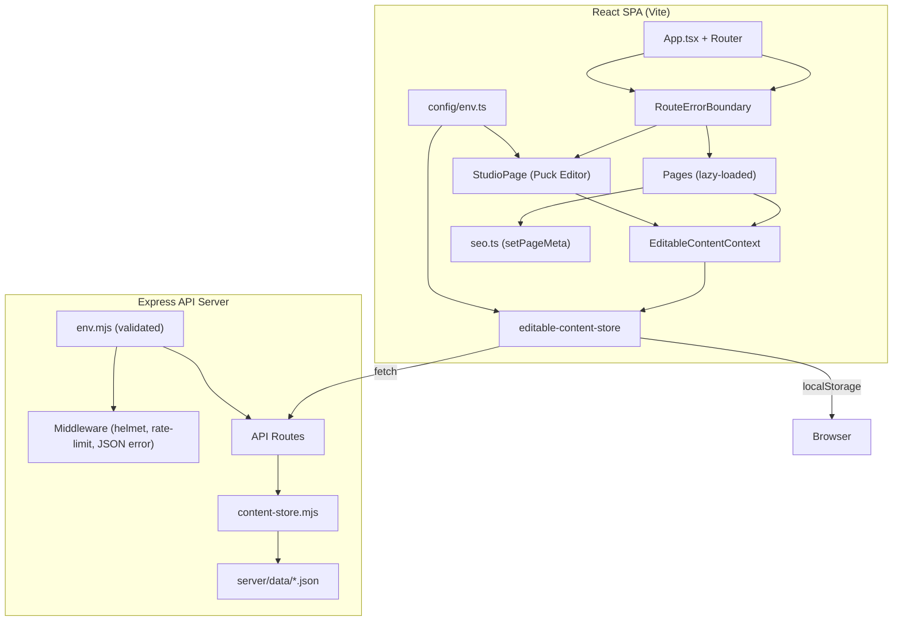

# Design Document: Production-Grade Polish

## Overview

This design covers a comprehensive production-readiness pass on the Baba Flats apartment website — a React 19 + TypeScript + Vite SPA with an Express 5 backend, a Puck-based visual Studio editor, an editable content system backed by localStorage and server-side JSON files, a contact form with SMTP/webhook integrations, and a gallery with lightbox.

The work spans 15 requirement areas: security hardening (secrets removal, input validation, rate limiting, security headers), dead code cleanup, component reorganization, error boundaries, form validation, accessibility (WCAG), performance optimization (bundle dedup, lazy loading, CLS prevention), SEO meta management, a 404 page, content system robustness, automated testing foundation, environment configuration standardization, TypeScript strictness, and build/deployment readiness. Additionally, the Studio UI receives a comprehensive UX overhaul.

### Key Design Decisions

1. **Single motion library**: Standardize on `motion` (the v12+ package) and remove all `framer-motion` imports. Both packages are the same library at different versions; keeping both doubles the bundle.
2. **Centralized env access**: Server uses `server/env.mjs`, client uses `src/config/env.ts`. No other module reads `process.env` or `import.meta.env` directly.
3. **No hardcoded secrets**: Remove the `"shubh123"` fallback from both `server/env.mjs` and `src/config/env.ts`. Server refuses to start without `STUDIO_PASSWORD`; Studio shows a config error.
4. **Error boundaries via a reusable `RouteErrorBoundary` component**: Wraps each `<Route>` element in `App.tsx`.
5. **Form validation with a `useFormValidation` hook**: Provides field-level validation state, inline error messages, and `aria-describedby` linkage.
6. **Property-based testing with `fast-check`**: The `vitest` + `fast-check` combo for property tests; standard `vitest` for unit/integration tests.
7. **Studio UI overhaul**: Redesigned toolbar, responsive sidebar, loading/saving states, keyboard shortcuts, and visual polish using the existing design system tokens.

## Architecture



### Directory Structure (Target)

```
src/
├── components/
│   ├── layout/           # SiteHeader, SiteFooter, SitePreloader
│   ├── media/            # OptimizedImage
│   ├── studio/           # Puck editor components
│   └── ui/               # shadcn/ui primitives
├── config/
│   ├── env.ts            # Single client env source
│   ├── studio-auth.ts
│   └── editable-components.ts
├── context/
├── lib/
│   ├── editable-content-store.ts
│   ├── editable-content-defaults.ts
│   ├── motion.ts         # Reveal, StaggerContainer, StaggerItem
│   ├── seo.ts
│   ├── utils.ts
│   └── validation.ts     # Form validation utilities
├── pages/
│   ├── HomePage.tsx
│   ├── GalleryPage.tsx
│   ├── ContactPage.tsx
│   ├── StudioPage.tsx
│   └── NotFoundPage.tsx
└── types/
```

Removed directories: `src/components/site/` (empty), `src/components/storyblok/` (empty), `src/legacy/` (backup stubs).
Removed files: all `*.bak` files in `src/components/ui/`, `src/components/Accordion.tsx`, `src/components/Tabs.tsx` (duplicates of `ui/accordion.tsx` and `ui/tabs.tsx`), `src/components/Parallax.tsx` and `src/components/ParallaxNew.tsx` (consolidated).

## Components and Interfaces

### 1. Environment & Secrets (Requirements 1, 13)

**`server/env.mjs`** — Remove the hardcoded `"shubh123"` fallback for `studioPassword`. Add a startup validation function that throws if required vars are missing.

```typescript
// Pseudocode for server/env.mjs changes
export const env = {
  studioPassword: clean(process.env.STUDIO_PASSWORD || process.env.VITE_STUDIO_PASSWORD, ""),
  // ... other fields unchanged
};

export function validateRequiredEnv() {
  const missing = [];
  if (!env.studioPassword) missing.push("STUDIO_PASSWORD");
  if (missing.length > 0) {
    console.error(`Missing required environment variables: ${missing.join(", ")}`);
    process.exit(1);
  }
}
```

**`src/config/env.ts`** — Remove the `"shubh123"` fallback. Return empty string when `VITE_STUDIO_PASSWORD` is unset.

```typescript
export const appEnv = {
  studioPassword: clean(rawEnv.VITE_STUDIO_PASSWORD),  // no fallback
  // ...
} as const;
```

**`StudioPage.tsx`** — When `STUDIO_PASSWORD` is empty, render a configuration error panel instead of the login form.

### 2. Dead Code Cleanup (Requirement 2)

| File/Directory | Action |
|---|---|
| `src/components/ui/Card3D.tsx.bak` | Delete |
| `src/components/ui/FocusCards.tsx.bak` | Delete |
| `src/components/ui/LampEffect.tsx.bak` | Delete |
| `src/components/ui/ParallaxScrollGrid.tsx.bak` | Delete |
| `src/components/ui/StickyScrollReveal.tsx.bak` | Delete |
| `src/components/site/` (empty) | Delete |
| `src/components/storyblok/` (empty) | Delete |
| `src/legacy/pages/HomePage-backup.tsx` | Delete |
| `src/components/Accordion.tsx` | Delete (duplicate of `ui/accordion.tsx`) |
| `src/components/Tabs.tsx` | Delete (duplicate of `ui/tabs.tsx`) |
| `framer-motion` in `package.json` | Remove dependency |

All files currently importing from `"framer-motion"` will be updated to import from `"motion/react"`:
- `src/pages/GalleryPage.tsx`
- `src/pages/ContactPage.tsx`
- `src/components/SitePreloader.tsx`
- `src/components/motion.tsx`
- `src/components/Parallax.tsx`
- `src/components/ParallaxNew.tsx`

### 3. Component Reorganization (Requirement 3)

Move layout components to `src/components/layout/`:
- `SiteHeader.tsx` → `src/components/layout/SiteHeader.tsx`
- `SiteFooter.tsx` → `src/components/layout/SiteFooter.tsx`
- `SitePreloader.tsx` → `src/components/layout/SitePreloader.tsx`

Move motion utilities:
- `src/components/motion.tsx` → `src/lib/motion.ts` (rename to `.ts` since it exports only logic, or keep `.tsx` if JSX is used)

Consolidate parallax:
- Keep `src/components/Parallax.tsx` as the canonical parallax component, delete `ParallaxNew.tsx` if unused or merge.

Ensure all imports use `@/` path aliases consistently.

### 4. Error Boundaries (Requirement 4)

**New component: `src/components/layout/RouteErrorBoundary.tsx`**

```typescript
interface RouteErrorBoundaryProps {
  children: React.ReactNode;
}

interface RouteErrorBoundaryState {
  hasError: boolean;
  error: Error | null;
}

class RouteErrorBoundary extends React.Component<Props, State> {
  static getDerivedStateFromError(error: Error) { return { hasError: true, error }; }
  
  handleRetry = () => { this.setState({ hasError: false, error: null }); };
  
  render() {
    if (this.state.hasError) {
      return <ErrorFallbackUI error={this.state.error} onRetry={this.handleRetry} />;
    }
    return this.props.children;
  }
}
```

**Integration in `App.tsx`**: Wrap each `<Route>` element:
```tsx
<Route path="/" element={
  <RouteErrorBoundary>
    <Suspense fallback={<RouteFallback />}><HomePage /></Suspense>
  </RouteErrorBoundary>
} />
```

**`editable-content-store.ts`** — The `parseDocument` function already returns `null` on parse failure. Add `console.warn` when falling back to defaults.

**`server/index.mjs`** — Add JSON parse error middleware:
```javascript
app.use((err, req, res, next) => {
  if (err.type === 'entity.parse.failed') {
    return res.status(400).json({ ok: false, message: 'Malformed JSON in request body' });
  }
  next(err);
});
```

### 5. Contact Form Validation (Requirement 5)

**New module: `src/lib/validation.ts`**

```typescript
export type ValidationRule = {
  validate: (value: string) => boolean;
  message: string;
};

export const validators = {
  required: (label: string): ValidationRule => ({
    validate: (v) => v.trim().length > 0,
    message: `${label} is required`,
  }),
  email: (): ValidationRule => ({
    validate: (v) => /^[^\s@]+@[^\s@]+\.[^\s@]+$/.test(v),
    message: "Enter a valid email address",
  }),
  phone: (): ValidationRule => ({
    validate: (v) => (v.match(/\d/g) || []).length >= 10,
    message: "Phone number must contain at least 10 digits",
  }),
};

export function validateField(value: string, rules: ValidationRule[]): string | null {
  for (const rule of rules) {
    if (!rule.validate(value)) return rule.message;
  }
  return null;
}
```

**ContactPage.tsx changes**:
- Add field-level validation state (`errors` object)
- Run validation on blur and on submit
- Display inline error messages adjacent to each field
- Link errors via `aria-describedby` (e.g., `<span id="email-error">...</span>` + `aria-describedby="email-error"`)
- Disable submit button when `isSubmitting` is true (already partially done, but ensure `disabled` attribute is set)

### 6. Server Security (Requirement 6)

**Security headers** — Add `helmet` middleware or manual header setting:
```javascript
app.use((req, res, next) => {
  res.setHeader("X-Content-Type-Options", "nosniff");
  res.setHeader("X-Frame-Options", "DENY");
  res.setHeader("Referrer-Policy", "strict-origin-when-cross-origin");
  next();
});
```

**Rate limiting** — Use `express-rate-limit`:
```javascript
import rateLimit from "express-rate-limit";
const contactLimiter = rateLimit({ windowMs: 60_000, max: 10, message: { ok: false, message: "Too many requests" } });
app.post("/api/contact/submit", contactLimiter, async (req, res) => { ... });
```

**Upload size enforcement** — Already configured via `multer.limits.fileSize`. Add explicit 413 handling in the multer error callback.

**Filename sanitization** — Already partially done via the `filename` callback in multer storage. Enhance to explicitly strip `../` and `..\\`:
```javascript
const safeName = baseName.replace(/\.\./g, "").replace(/[/\\]/g, "-");
```

**Auth middleware** — Already exists as `requireStudioAuth`. Ensure all `/api/content/*` routes use it.

**Corrupted JSON handling** — Wrap `readJson` in `content-store.mjs` with try/catch:
```javascript
async function readJson(filePath) {
  try {
    const raw = await readFile(filePath, "utf-8");
    return JSON.parse(raw);
  } catch (err) {
    throw new Error(`Corrupted JSON file: ${filePath}`);
  }
}
```
Then catch in route handlers and return 500.

### 7. Accessibility (Requirement 7)

**Skip-to-content link** in `SiteHeader`:
```tsx
<a href="#main-content" className="sr-only focus:not-sr-only focus:absolute ...">
  Skip to content
</a>
```

**Mobile nav toggle** — Add a hamburger `<button>` with `aria-expanded={isOpen}` and `aria-controls="mobile-nav"`. The mobile nav gets `id="mobile-nav"`.

**Gallery keyboard access** — Change gallery `<figure>` click handlers to use `<button>` elements or add `role="button"` + `tabIndex={0}` + `onKeyDown` (Enter/Space) handlers.

**Form label association** — Add `id` attributes to all form inputs and `htmlFor` to `<Label>` components. Add `aria-describedby` pointing to error message `<span>` elements.

**Preloader** — Already has `role="status"` and `aria-live="polite"`. Verified in current code.

### 8. Performance (Requirement 8)

**Lazy loading** — Already implemented for all route pages via `React.lazy`. Verified in `App.tsx`.

**OptimizedImage** — Add `width`/`height` props or `aspect-ratio` CSS to prevent CLS. The component should accept optional `width`/`height` and render them on the `` tag.

**Motion library dedup** — Remove `framer-motion` from `package.json`, update all imports to `motion/react`.

**LCP preload** — Add to `index.html`:
```html
<link rel="preload" as="image" href="/images/hero.avif" type="image/avif" fetchpriority="high" />
```
Or set `fetchpriority="high"` on the hero `<OptimizedImage>`.

**Header animation** — Current animation uses `y` and `opacity` via `motion.header`. The `y` transform maps to CSS `transform: translateY()`, which is composited and doesn't cause layout shift. Verified correct.

**Reduced motion** — Add `useReducedMotion()` checks in `SitePreloader`, `Reveal`, and other animation components. When true, skip entrance animations.

### 9. SEO (Requirement 9)

**Enhanced `setPageMeta`**:
```typescript
export function setPageMeta(options: {
  title: string;
  description: string;
  canonicalPath?: string;
  ogImage?: string;
}) {
  document.title = options.title;
  updateMeta("description", options.description);
  updateMeta("og:title", options.title, "property");
  updateMeta("og:description", options.description, "property");
  if (options.ogImage) updateMeta("og:image", options.ogImage, "property");
  if (options.canonicalPath) updateCanonical(options.canonicalPath);
}
```

Each page calls `setPageMeta` with unique values in its `useEffect`.

**`public/robots.txt`**:
```
User-agent: *
Allow: /
Disallow: /studio
```

### 10. 404 Page (Requirement 10)

**New component: `src/pages/NotFoundPage.tsx`**

```tsx
export default function NotFoundPage() {
  useEffect(() => { setPageMeta({ title: "Page Not Found", description: "..." }); }, []);
  return (
    <main id="main-content">
      <h1>Page Not Found</h1>
      <p>The page you're looking for doesn't exist.</p>
      <Link to="/">Back to Home</Link>
    </main>
  );
}
```

**`App.tsx`** — Replace `<Route path="*" element={<Navigate to="/" replace />} />` with `<Route path="*" element={<NotFoundPage />} />`.

### 11. Content System Robustness (Requirement 11)

**localStorage quota handling** — Wrap `localStorage.setItem` in try/catch:
```typescript
export function writeDraftDocument(document: EditableSiteDocument) {
  const hydrated = hydrateDocument(document);
  try {
    window.localStorage.setItem(DRAFT_KEY, JSON.stringify(withUpdatedAt(hydrated)));
  } catch (e) {
    if (e instanceof DOMException && e.name === "QuotaExceededError") {
      toast.warning("Storage quota exceeded. Draft preserved in memory only.");
    }
  }
}
```

**Validation on read** — `readDraftDocument` already calls `parseDocument` which returns `null` on failure, then falls back to `readPublishedDocument()` → `defaultEditableSiteDocument`. Add explicit `validateEditableSiteDocument` call and `console.warn` on failure.

**Publish to API** — In `EditableContentContext.publish()`, after writing to localStorage, also `POST` to `/api/content/draft` and then `/api/content/publish`.

**Version field** — Add version check in `coerceEditableSiteDocument`:
```typescript
const CURRENT_VERSION = 1;
if (partial.version > CURRENT_VERSION) {
  return { document: null, errors: [`Document version ${partial.version} is newer than supported version ${CURRENT_VERSION}`] };
}
```

### 12. Studio UI Improvements

The Studio page currently has a functional but rough UI. The following improvements bring it to production quality:

#### 12a. Redesigned Toolbar

The current toolbar is a single row of wrapped buttons that becomes cluttered on smaller screens. Redesign as a structured header:

```
┌─────────────────────────────────────────────────────────────┐
│ [Logo] Studio          [Home|Gallery|Contact|Global]        │
│                                                             │
│ [Live|Draft] [Autosave status]    [Revert][Publish][⋮ More]│
└─────────────────────────────────────────────────────────────┘
```

- Group related actions: canvas mode (Live/Draft) on the left, section tabs centered, actions (Revert/Publish) on the right
- Overflow menu (⋮) for secondary actions: Download, Import, Copy JSON, Lock
- Responsive: on mobile, section tabs become a dropdown `<Select>`

#### 12b. Loading & Saving States

- Show a skeleton/spinner while Puck initializes
- Autosave indicator: subtle pulse animation on the status badge when saving
- Publish confirmation dialog (currently uses `window.confirm` — replace with a styled dialog)
- Revert confirmation dialog (same treatment)

#### 12c. Login Screen Polish

- Center the login card vertically and horizontally
- Add the site logo/brand above the form
- Show a "missing configuration" error state when `STUDIO_PASSWORD` is empty (Requirement 1.4)
- Add loading state on the unlock button

#### 12d. Puck Editor Wrapper Improvements

- Add a subtle border and shadow around the Puck canvas area
- Show a "no unsaved changes" / "unsaved changes" indicator more prominently
- Add keyboard shortcuts: `Ctrl+S` to save draft, `Ctrl+Shift+P` to publish
- Add a "Preview in new tab" button that opens the site in draft mode

#### 12e. Error States

- When Puck data validation fails, show an inline error banner above the canvas (not just a toast)
- When API sync fails, show a persistent warning bar with retry action
- When import fails, show the error inline near the import button

#### 12f. Responsive Design

- On screens < 768px, collapse the toolbar into a compact header with a hamburger menu for actions
- The Puck editor canvas should be full-width on mobile
- Section tabs should become a horizontal scrollable strip or dropdown on small screens

### 13. Testing Foundation (Requirement 12)

**Testing stack**: `vitest` (already configured) + `fast-check` for property-based tests.

**Test files**:
- `src/lib/editable-content-store.test.ts` — Unit tests for read/write/publish/reset + round-trip property test
- `src/lib/utils.test.ts` — Unit tests for `resolveAppHref`
- `src/lib/seo.test.ts` — Unit tests for `setPageMeta`
- `src/lib/validation.test.ts` — Property tests for form validators
- `server/__tests__/contact-submit.test.mjs` — Integration tests for `/api/contact/submit`

### 14. TypeScript Strictness (Requirement 14)

- Replace `any` in StudioPage Puck config `render` functions with typed props interfaces (e.g., `GlobalBrandProps`, `HomeHeroProps`)
- Replace `as any` casts on Puck `config` and `data` with proper generic types or `satisfies` assertions with comments
- Add explicit types to server route handler parameters
- Audit and remove unjustified `as any` / `as unknown` casts

### 15. Build & Deployment (Requirement 15)

- Fix `package.json` repository/bugs/homepage URLs (remove `your-username` placeholders)
- Add `public/robots.txt` (covered in SEO section)
- Verify `public/favicon.ico` exists or add one
- Add production error handling in server:
```javascript
const isProduction = process.env.NODE_ENV === "production";
app.use((err, req, res, next) => {
  res.status(500).json({
    ok: false,
    message: isProduction ? "Internal server error" : err.message,
  });
});
```

## Data Models

### EditableSiteDocument (unchanged structure, new version semantics)

The existing `EditableSiteDocument` type remains unchanged. The `version` field gains enforcement:

```typescript
// Current version constant
export const CURRENT_DOCUMENT_VERSION = 1;

// Version check in coerceEditableSiteDocument
if (input.version > CURRENT_DOCUMENT_VERSION) {
  return { document: null, errors: ["Document version too new"] };
}
```

### Form Validation State

```typescript
type FieldErrors = Record<string, string | null>;

type FormValidationState = {
  errors: FieldErrors;
  touched: Record<string, boolean>;
  isValid: boolean;
  validate: (field: string, value: string) => string | null;
  validateAll: (values: Record<string, string>) => boolean;
  setTouched: (field: string) => void;
};
```

### SEO Meta Options

```typescript
type PageMetaOptions = {
  title: string;
  description: string;
  canonicalPath?: string;
  ogImage?: string;
};
```


## Correctness Properties

*A property is a characteristic or behavior that should hold true across all valid executions of a system — essentially, a formal statement about what the system should do. Properties serve as the bridge between human-readable specifications and machine-verifiable correctness guarantees.*

### Property 1: Corrupted localStorage content falls back to defaults

*For any* arbitrary string stored in the localStorage draft key (including malformed JSON, truncated JSON, empty strings, and strings representing objects missing required fields), reading the draft document should return a valid `EditableSiteDocument` that passes `validateEditableSiteDocument` — either the parsed+hydrated document or the default document.

**Validates: Requirements 4.3, 11.2**

### Property 2: Malformed JSON request body returns 400

*For any* HTTP request to a JSON-accepting API endpoint with a body that is not valid JSON (random byte sequences, truncated JSON, XML, plain text), the API server should return a 400 status code with a JSON response containing an error message, and should not crash.

**Validates: Requirements 4.4**

### Property 3: Empty required field triggers validation error

*For any* required field in the contact form (fullName, email, phone) and any string value that is empty or composed entirely of whitespace, the validation function should return a non-null error message, and the form should not submit.

**Validates: Requirements 5.1**

### Property 4: Invalid email format triggers validation error

*For any* string that does not match the pattern `[non-whitespace]@[non-whitespace].[non-whitespace]`, the email validator should return a non-null error message.

**Validates: Requirements 5.2**

### Property 5: Invalid phone number triggers validation error

*For any* string containing fewer than 10 digit characters (0-9), the phone validator should return a non-null error message.

**Validates: Requirements 5.3**

### Property 6: Security headers present on all API responses

*For any* API endpoint and any valid or invalid request, the response should include `X-Content-Type-Options`, `X-Frame-Options`, and `Referrer-Policy` headers with their configured values.

**Validates: Requirements 6.1**

### Property 7: Oversized upload returns 413

*For any* file upload request where at least one file exceeds the configured size limit (12 MB), the API server should return a 400 or 413 status code and should not persist the file to disk.

**Validates: Requirements 6.3**

### Property 8: Filename sanitization removes path traversal

*For any* uploaded filename containing path traversal sequences (`../`, `..\\`, `/`, `\\`), the sanitized filename stored on disk should not contain any of these sequences, and the resulting path should remain within the upload directory.

**Validates: Requirements 6.4**

### Property 9: Unauthenticated content requests return 401

*For any* request to any `/api/content/*` endpoint that either omits the `x-studio-password` header or provides an incorrect value, the API server should return a 401 status code with a JSON error body.

**Validates: Requirements 6.5**

### Property 10: Corrupted JSON file on disk returns 500

*For any* content endpoint that reads from disk, if the underlying JSON file contains invalid JSON (random bytes, truncated content, empty file), the API server should return a 500 status code with a descriptive error message and should not crash.

**Validates: Requirements 6.6**

### Property 11: Gallery items are keyboard accessible

*For any* gallery item rendered in the gallery grid, the trigger element should be either a `<button>` element or an element with `role="button"` and `tabIndex={0}`, and should respond to both click and keyboard (Enter/Space) events to open the lightbox.

**Validates: Requirements 7.3**

### Property 12: Form inputs have associated labels

*For any* input element in the contact form, there should exist a `<label>` element with a `htmlFor` attribute matching the input's `id` attribute.

**Validates: Requirements 7.4**

### Property 13: Validation errors linked via aria-describedby

*For any* contact form field that has a validation error displayed, the input element should have an `aria-describedby` attribute pointing to the `id` of the error message element.

**Validates: Requirements 7.5**

### Property 14: Reduced motion disables non-essential animations

*For any* animation component (Reveal, SitePreloader, parallax effects), when `prefers-reduced-motion` is enabled (i.e., `useReducedMotion()` returns `true`), the component should render without entrance animations — either by setting `initial` and `animate` to the same values or by skipping the motion wrapper entirely.

**Validates: Requirements 8.6**

### Property 15: Route meta tags are complete and unique

*For any* route in the application (Home, Gallery, Contact, 404), after navigation the document should have: a non-empty `<title>`, a `<meta name="description">` with non-empty content, `<meta property="og:title">` and `<meta property="og:description">` tags, and a `<link rel="canonical">` tag with the correct path. Additionally, no two routes should share the same title.

**Validates: Requirements 9.1, 9.2, 9.3, 9.4**

### Property 16: Document version rejection

*For any* `EditableSiteDocument` where the `version` field is a number greater than `CURRENT_DOCUMENT_VERSION`, the `coerceEditableSiteDocument` function should return `{ document: null }` with an error message indicating the version is unsupported.

**Validates: Requirements 11.4**

### Property 17: Editable content round-trip serialization

*For any* valid `EditableSiteDocument`, serializing it to JSON via `JSON.stringify` and then parsing it back via `JSON.parse` followed by `hydrateDocument` should produce a document that is deeply equal to the original (modulo the `updatedAt` timestamp).

**Validates: Requirements 12.5**

### Property 18: Production mode hides error details

*For any* server error that occurs when `NODE_ENV=production`, the API response body should contain a generic error message (e.g., "Internal server error") and should not include stack traces, file paths, or internal error details.

**Validates: Requirements 15.4**

### Property 19: setPageMeta updates all meta tags

*For any* title string, description string, and canonical path, calling `setPageMeta` should update the document title, the description meta tag, the og:title meta tag, the og:description meta tag, and the canonical link tag to the provided values.

**Validates: Requirements 9.4**

### Property 20: Consistent import path aliases

*For any* TypeScript/TSX source file in `src/`, all imports of other `src/` modules should use the `@/` path alias rather than relative paths (e.g., `@/lib/utils` instead of `../../lib/utils`).

**Validates: Requirements 3.5**

## Error Handling

### Client-Side Error Handling

| Scenario | Handler | User Feedback |
|---|---|---|
| Route component render crash | `RouteErrorBoundary` | Fallback UI with "Something went wrong" message and Retry button |
| localStorage parse failure | `parseDocument` returns null → fallback to defaults | Console warning; user sees default content |
| localStorage quota exceeded | try/catch in `writeDraftDocument` | Toast warning: "Storage quota exceeded" |
| API unreachable (contact form) | catch block in `handleSubmit` | Toast error: "API server is unavailable" |
| Puck data validation failure | `validateEditableSiteDocument` | Inline error banner above canvas + toast |
| Import JSON parse failure | catch block in `handleImportFile` | Inline message near import button + toast |
| Studio password not configured | Check in `StudioPage` render | Configuration error panel instead of login |

### Server-Side Error Handling

| Scenario | Status | Response |
|---|---|---|
| Malformed JSON body | 400 | `{ ok: false, message: "Malformed JSON in request body" }` |
| Missing auth header | 401 | `{ ok: false, message: "Unauthorized" }` |
| File too large | 413 | `{ ok: false, message: "File too large" }` |
| Rate limit exceeded | 429 | `{ ok: false, message: "Too many requests" }` |
| Corrupted JSON on disk | 500 | `{ ok: false, message: "Corrupted data file" }` |
| Unhandled error (production) | 500 | `{ ok: false, message: "Internal server error" }` |
| Unhandled error (development) | 500 | `{ ok: false, message: "<actual error message>" }` |

### Error Boundary Recovery Strategy

The `RouteErrorBoundary` provides a Retry button that resets the error state and re-renders the child component. For persistent errors (e.g., corrupted content), the user can navigate to a different page. The error boundary logs the error to `console.error` for debugging.

## Testing Strategy

### Testing Stack

- **Unit & integration tests**: `vitest` (already configured in the project)
- **Property-based tests**: `fast-check` library with `vitest` integration
- **Minimum iterations**: 100 per property test (configurable via `fc.assert` `numRuns` parameter)

### Dual Testing Approach

**Unit tests** cover specific examples, edge cases, and integration points:
- `editable-content-store`: read/write/publish/reset with specific document fixtures
- `resolveAppHref`: absolute URLs, relative paths, hash links, tel/mailto, base path handling
- `setPageMeta`: verify DOM updates for title, description, canonical, OG tags
- `validation.ts`: specific valid/invalid email and phone examples
- `/api/contact/submit`: valid submission, missing fields, malformed payload

**Property tests** cover universal properties across randomized inputs:
- Each correctness property (1-20) maps to one property-based test
- Tests use `fast-check` arbitraries to generate random inputs
- Each test is tagged with a comment: `// Feature: production-grade-polish, Property N: <title>`

### Test File Organization

```
src/lib/
├── editable-content-store.test.ts    # Unit + Property tests (P1, P16, P17)
├── validation.test.ts                # Property tests (P3, P4, P5)
├── seo.test.ts                       # Unit + Property tests (P15, P19)
├── utils.test.ts                     # Unit tests for resolveAppHref
server/
├── __tests__/
│   ├── contact-submit.test.mjs       # Integration tests
│   ├── security.test.mjs             # Property tests (P6, P7, P8, P9, P10, P18)
│   └── env-validation.test.mjs       # Unit tests for startup validation
```

### Property Test Tagging

Each property test must include a comment referencing the design property:

```typescript
// Feature: production-grade-polish, Property 17: Editable content round-trip serialization
test.prop("round-trip serialization preserves document", [editableSiteDocumentArb], (doc) => {
  const serialized = JSON.stringify(doc);
  const parsed = JSON.parse(serialized);
  const hydrated = hydrateDocument(parsed);
  expect(hydrated).toEqual(doc);
});
```

### Property-Based Testing Configuration

- Library: `fast-check` (npm package)
- Integration: `@fast-check/vitest` or direct `fc.assert` within vitest `test` blocks
- Minimum runs: 100 per property (`{ numRuns: 100 }`)
- Seed logging: enabled for reproducibility
- Each correctness property is implemented by exactly one property-based test
